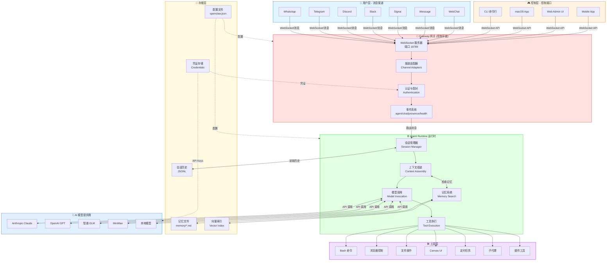

# OpenClaw 系统架构图

生成时间：2026-03-07 10:48 (Asia/Shanghai)

---

## 🔗 draw.io 链接

https://app.diagrams.net/?create=%7B%22type%22%3A%22mermaid%22%2C%22data%22%3A%22flowchart%20TB%5Cn%20%20%20%20subgraph%20UserLayer%5B%5C%22%F0%9F%91%A4%20%E7%94%A8%E6%88%B7%E5%B1%82%20-%20%E6%B6%88%E6%81%AF%E6%B8%A0%E9%81%93%5C%22%5D%5Cn%20%20%20%20%20%20%20%20WA%5BWhatsApp%5D%5Cn%20%20%20%20%20%20%20%20TG%5BTelegram%5D%5Cn%20%20%20%20%20%20%20%20DS%5BDiscord%5D%5Cn%20%20%20%20%20%20%20%20SL%5BSlack%5D%5Cn%20%20%20%20%20%20%20%20SG%5BSignal%5D%5Cn%20%20%20%20%20%20%20%20iMsg%5BiMessage%5D%5Cn%20%20%20%20%20%20%20%20Web%5BWebChat%5D%5Cn%20%20%20%20end%5Cn%5Cn%20%20%20%20subgraph%20ControlLayer%5B%5C%22%F0%9F%8E%AE%20%E6%8E%A7%E5%88%B6%E5%B1%82%20-%20%E6%8E%A7%E5%88%B6%E6%8E%A5%E5%8F%A3%5C%22%5D%5Cn%20%20%20%20%20%20%20%20CLI%5BCLI%20%E5%91%BD%E4%BB%A4%E8%A1%8C%5D%5Cn%20%20%20%20%20%20%20%20MacApp%5BmacOS%20App%5D%5Cn%20%20%20%20%20%20%20%20WebUI%5BWeb%20Admin%20UI%5D%5Cn%20%20%20%20%20%20%20%20Mobile%5BMobile%20App%5D%5Cn%20%20%20%20end%5Cn%5Cn%20%20%20%20subgraph%20Gateway%5B%5C%22%F0%9F%9A%AA%20Gateway%20%E7%BD%91%E5%85%B3%20(%E6%8E%A7%E5%88%B6%E5%B9%B3%E9%9D%A2)%5C%22%5D%5Cn%20%20%20%20%20%20%20%20WS%5BWebSocket%20%E6%9C%8D%E5%8A%A1%E5%99%A8%3Cbr%2F%3E%E7%AB%AF%E5%8F%A3%2018789%5D%5Cn%20%20%20%20%20%20%20%20ChannelAdapters%5B%E6%B8%A0%E9%81%93%E9%80%82%E9%85%8D%E5%99%A8%3Cbr%2F%3EChannel%20Adapters%5D%5Cn%20%20%20%20%20%20%20%20Auth%5B%E8%AE%A4%E8%AF%81%E4%B8%8E%E9%85%8D%E5%AF%B9%3Cbr%2F%3EAuthentication%5D%5Cn%20%20%20%20%20%20%20%20Events%5B%E4%BA%8B%E4%BB%B6%E7%B3%BB%E7%BB%9F%3Cbr%2F%3Eagent%2Fchat%2Fpresence%2Fhealth%5D%5Cn%20%20%20%20end%5Cn%5Cn%20%20%20%20subgraph%20Runtime%5B%5C%22%E2%9A%99%EF%B8%8F%20Agent%20Runtime%20%E8%BF%90%E8%A1%8C%E6%97%B6%5C%22%5D%5Cn%20%20%20%20%20%20%20%20SessionMgr%5B%E4%BC%9A%E8%AF%9D%E7%AE%A1%E7%90%86%E5%99%A8%3Cbr%2F%3ESession%20Manager%5D%5Cn%20%20%20%20%20%20%20%20ContextAsm%5B%E4%B8%8A%E4%B8%8B%E6%96%87%E7%BB%84%E8%A3%85%3Cbr%2F%3EContext%20Assembly%5D%5Cn%20%20%20%20%20%20%20%20ModelInvoker%5B%E6%A8%A1%E5%9E%8B%E8%B0%83%E7%94%A8%3Cbr%2F%3EModel%20Invocation%5D%5Cn%20%20%20%20%20%20%20%20ToolExec%5B%E5%B7%A5%E5%85%B7%E6%89%A7%E8%A1%8C%3Cbr%2F%3ETool%20Execution%5D%5Cn%20%20%20%20%20%20%20%20Memory%5B%E8%AE%B0%E5%BF%86%E7%B3%BB%E7%BB%9F%3Cbr%2F%3EMemory%20Search%5D%5Cn%20%20%20%20end%5Cn%5Cn%20%20%20%20subgraph%20Tools%5B%5C%22%F0%9F%9B%A0%EF%B8%8F%20%E5%B7%A5%E5%85%B7%E5%B1%82%5C%22%5D%5Cn%20%20%20%20%20%20%20%20Bash%5BBash%20%E5%91%BD%E4%BB%A4%5D%5Cn%20%20%20%20%20%20%20%20Browser%5B%E6%B5%8F%E8%A7%88%E5%99%A8%E6%8E%A7%E5%88%B6%5D%5Cn%20%20%20%20%20%20%20%20Files%5B%E6%96%87%E4%BB%B6%E6%93%8D%E4%BD%9C%5D%5Cn%20%20%20%20%20%20%20%20Canvas%5BCanvas%20UI%5D%5Cn%20%20%20%20%20%20%20%20Cron%5B%E5%AE%9A%E6%97%B6%E4%BB%BB%E5%8A%A1%5D%5Cn%20%20%20%20%20%20%20%20Subagents%5B%E5%AD%90%E4%BB%A3%E7%90%86%5D%5Cn%20%20%20%20%20%20%20%20Plugins%5B%E6%8F%92%E4%BB%B6%E5%B7%A5%E5%85%B7%5D%5Cn%20%20%20%20end%5Cn%5Cn%20%20%20%20subgraph%20Storage%5B%5C%22%F0%9F%92%BE%20%E5%AD%98%E5%82%A8%E5%B1%82%5C%22%5D%5Cn%20%20%20%20%20%20%20%20Sessions%5B%E4%BC%9A%E8%AF%9D%E5%8E%86%E5%8F%B2%3Cbr%2F%3EJSONL%5D%5Cn%20%20%20%20%20%20%20%20Config%5B%E9%85%8D%E7%BD%AE%E6%96%87%E4%BB%B6%3Cbr%2F%3Eopenclaw.json%5D%5Cn%20%20%20%20%20%20%20%20MemoryFiles%5B%E8%AE%B0%E5%BF%86%E6%96%87%E4%BB%B6%3Cbr%2F%3Ememory%2F*.md%5D%5Cn%20%20%20%20%20%20%20%20VectorDB%5B%E5%90%91%E9%87%8F%E7%B4%A2%E5%BC%95%3Cbr%2F%3EVector%20Index%5D%5Cn%20%20%20%20%20%20%20%20Creds%5B%E5%87%AD%E8%AF%81%E5%AD%98%E5%82%A8%3Cbr%2F%3ECredentials%5D%5Cn%20%20%20%20end%5Cn%5Cn%20%20%20%20subgraph%20Models%5B%5C%22%F0%9F%A4%96%20AI%20%E6%A8%A1%E5%9E%8B%E6%8F%90%E4%BE%9B%E5%95%86%5C%22%5D%5Cn%20%20%20%20%20%20%20%20Anthropic%5BAnthropic%20Claude%5D%5Cn%20%20%20%20%20%20%20%20OpenAI%5BOpenAI%20GPT%5D%5Cn%20%20%20%20%20%20%20%20GLM%5B%E6%99%BA%E8%B0%B1%20GLM%5D%5Cn%20%20%20%20%20%20%20%20MiniMax%5BMiniMax%5D%5Cn%20%20%20%20%20%20%20%20Local%5B%E6%9C%AC%E5%9C%B0%E6%A8%A1%E5%9E%8B%5D%5Cn%20%20%20%20end%5Cn%5Cn%20%20%20%20%25%25%20%E7%94%A8%E6%88%B7%E5%B1%82%E5%88%B0%E7%BD%91%E5%85%B3%E7%9A%84%E8%BF%9E%E6%8E%A5%5Cn%20%20%20%20WA%20%26%20TG%20%26%20DS%20%26%20SL%20%26%20SG%20%26%20iMsg%20%26%20Web%20--%3E%7CWebSocket%2F%E6%B6%88%E6%81%AF%20%7C%20WS%5Cn%20%20%20%20%5Cn%20%20%20%20%25%25%20%E6%8E%A7%E5%88%B6%E5%B1%82%E5%88%B0%E7%BD%91%E5%85%B3%E7%9A%84%E8%BF%9E%E6%8E%A5%5Cn%20%20%20%20CLI%20%26%20MacApp%20%26%20WebUI%20%26%20Mobile%20--%3E%7CWebSocket%20API%7C%20WS%5Cn%20%20%20%20%5Cn%20%20%20%20%25%25%20%E7%BD%91%E5%85%B3%E5%86%85%E9%83%A8%E6%B5%81%E7%A8%8B%5Cn%20%20%20%20WS%20--%3E%20ChannelAdapters%5Cn%20%20%20%20ChannelAdapters%20--%3E%20Auth%5Cn%20%20%20%20Auth%20--%3E%20Events%5Cn%20%20%20%20%5Cn%20%20%20%20%25%25%20%E7%BD%91%E5%85%B3%E5%88%B0%E8%BF%90%E8%A1%8C%E6%97%B6%5Cn%20%20%20%20Events%20--%3E%7C%E8%B7%AF%E7%94%B1%E6%B6%88%E6%81%AF%20%7C%20SessionMgr%5Cn%20%20%20%20%5Cn%20%20%20%20%25%25%20%E8%BF%90%E8%A1%8C%E6%97%B6%E5%86%85%E9%83%A8%E6%B5%81%E7%A8%8B%5Cn%20%20%20%20SessionMgr%20--%3E%20ContextAsm%5Cn%20%20%20%20ContextAsm%20--%3E%20ModelInvoker%5Cn%20%20%20%20ModelInvoker%20--%3E%20ToolExec%5Cn%20%20%20%20%5Cn%20%20%20%20%25%25%20%E8%BF%90%E8%A1%8C%E6%97%B6%E4%B8%8E%E5%AD%98%E5%82%A8%5Cn%20%20%20%20SessionMgr%20%3C--%3E%7C%E8%AF%BB%E5%8F%96%E5%8E%86%E5%8F%B2%20%7C%20Sessions%5Cn%20%20%20%20ContextAsm%20%3C--%3E%7C%E6%A3%80%E7%B4%A2%E8%AE%B0%E5%BF%86%20%7C%20Memory%5Cn%20%20%20%20Memory%20%3C--%3E%20MemoryFiles%5Cn%20%20%20%20Memory%20%3C--%3E%20VectorDB%5Cn%20%20%20%20%5Cn%20%20%20%20%25%25%20%E8%BF%90%E8%A1%8C%E6%97%B6%E4%B8%8E%E5%B7%A5%E5%85%B7%5Cn%20%20%20%20ToolExec%20--%3E%20Bash%20%26%20Browser%20%26%20Files%20%26%20Canvas%20%26%20Cron%20%26%20Subagents%20%26%20Plugins%5Cn%20%20%20%20%5Cn%20%20%20%20%25%25%20%E8%BF%90%E8%A1%8C%E6%97%B6%E4%B8%8E%E6%A8%A1%E5%9E%8B%5Cn%20%20%20%20ModelInvoker%20%3C--%3E%7CAPI%20%E8%B0%83%E7%94%A8%20%7C%20Anthropic%20%26%20OpenAI%20%26%20GLM%20%26%20MiniMax%20%26%20Local%5Cn%20%20%20%20%5Cn%20%20%20%20%25%25%20%E9%85%8D%E7%BD%AE%E7%AE%A1%E7%90%86%5Cn%20%20%20%20Config%20-.-%3E%7C%E9%85%8D%E7%BD%AE%20%7C%20Gateway%5Cn%20%20%20%20Config%20-.-%3E%7C%E9%85%8D%E7%BD%AE%20%7C%20Runtime%5Cn%20%20%20%20Creds%20-.-%3E%7C%E5%87%AD%E8%AF%81%20%7C%20Auth%5Cn%20%20%20%20Creds%20-.-%3E%7CAPI%20Keys%7C%20Models%5Cn%20%20%20%20%5Cn%20%20%20%20%25%25%20%E6%A0%B7%E5%BC%8F%5Cn%20%20%20%20style%20UserLayer%20fill%3A%23e1f5ff%2Cstroke%3A%230066cc%5Cn%20%20%20%20style%20ControlLayer%20fill%3A%23fff4e1%2Cstroke%3A%23cc6600%5Cn%20%20%20%20style%20Gateway%20fill%3A%23ffe1e1%2Cstroke%3A%23cc0000%5Cn%20%20%20%20style%20Runtime%20fill%3A%23e1ffe1%2Cstroke%3A%2300cc00%5Cn%20%20%20%20style%20Tools%20fill%3A%23f0e1ff%2Cstroke%3A%236600cc%5Cn%20%20%20%20style%20Storage%20fill%3A%23fff9e1%2Cstroke%3A%23cc9900%5Cn%20%20%20%20style%20Models%20fill%3A%23e1f0ff%2Cstroke%3A%230066cc%22%7D

---

## 📊 架构图说明

这张图展示了 OpenClaw 的完整系统架构，分为 7 个层次：

### 1. 👤 用户层 - 消息渠道
- WhatsApp
- Telegram
- Discord
- Slack
- Signal
- iMessage
- WebChat

### 2. 🎮 控制层 - 控制接口
- CLI 命令行
- macOS App
- Web Admin UI
- Mobile App

### 3. 🚪 Gateway 网关 - 控制平面
- WebSocket 服务器（端口 18789）
- 渠道适配器（Channel Adapters）
- 认证与配对（Authentication）
- 事件系统（agent/chat/presence/health）

### 4. ⚙️ Agent Runtime - 运行时核心
- 会话管理器 → 上下文组装 → 模型调用 → 工具执行
- 记忆系统（Memory Search）

### 5. 🛠️ 工具层
- Bash 命令
- 浏览器控制
- 文件操作
- Canvas UI
- 定时任务
- 子代理
- 插件工具

### 6. 💾 存储层
- 会话历史（JSONL）
- 配置文件（openclaw.json）
- 记忆文件（memory/*.md）
- 向量索引（Vector Index）
- 凭证存储（Credentials）

### 7. 🤖 AI 模型提供商
- Anthropic Claude
- OpenAI GPT
- 智谱 GLM
- MiniMax
- 本地模型

---

## 📝 Mermaid 源代码

---

生成工具：drawio-mcp (OpenClaw 插件)
版本：v1.0.0
